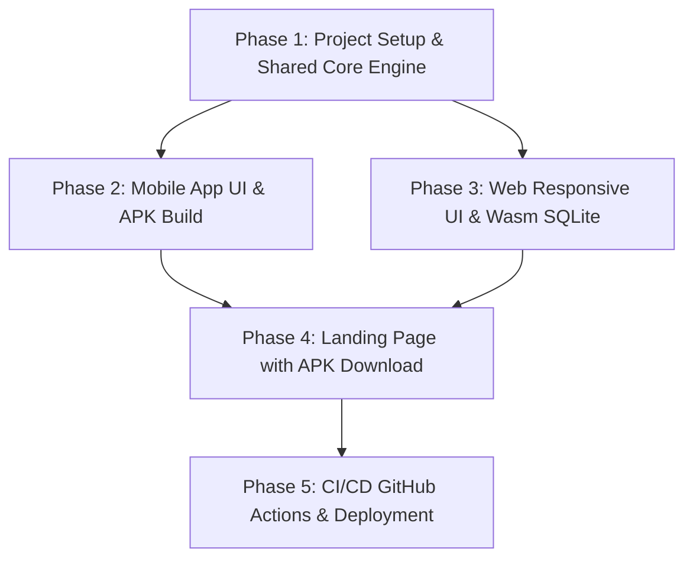

# Project Implementation Roadmap & Phases

This document outlines the phased delivery roadmap for **Vagabond Hero**, covering the three primary targets:
- **/landing**: The public landing and download page hosted via GitHub Pages.
- **/web**: The Flutter Web build runnable directly in modern desktop/mobile web browsers.
- **/mobile**: The native Flutter mobile application (Android APK & iOS).

---

## 🏗️ Monorepo & Target Architecture

To eliminate code duplication across **/web** and **/mobile**, game logic and presentation are built with Flutter cross-platform architecture using conditional persistence:

```text
Vagabond-Hero/
├── .github/
│   └── workflows/
│       ├── deploy-pages.yml        # Builds Flutter Web & deploys combined landing (/) & web demo (/play/) to GitHub Pages
│       └── build-mobile-apk.yml    # Compiles release APK & creates GitHub Release asset
├── landing/                        # Standalone Landing Page (vanilla HTML5/CSS3/JS, zero build tool overhead)
│   ├── index.html                  # Responsive showcase, lore teaser, APK download & Web player links
│   ├── styles.css                  # Dark fantasy terminal/parchment aesthetic
│   └── assets/                     # Screenshots, teaser art, download badges
├── mobile/                         # (or unified flutter app root configured for both mobile & web targets)
│   ├── lib/
│   │   ├── core/                   # Drift cross-platform DB (Wasm/IndexedDB for web, FFI/native SQLite for mobile)
│   │   ├── features/               # Combat, Navigation, Inventory, Character, Companions
│   │   └── main.dart
│   ├── web/                        # Flutter web manifest, index.html, canvaskit setup
│   └── android/                    # Android app configuration, icons, build configs
└── docs/                           # Architecture, mechanics, story acts, and roadmaps
    └── roadmap.md                  # This document
```

---

## 📅 Delivery Phases

### Phase 1: Shared Core Engine & Database Foundation
**Goal:** Implement the deterministic, offline-first game engine and persistent state shared by both Web and Mobile.

1. **Flutter Project Initialization & Structure**:
   - Initialize Flutter application with target platforms (`android`, `ios`, `web`).
   - Setup dependencies: `flutter_riverpod`, `drift`, `sqlite3_flutter_libs`, `freezed_annotation`, `json_annotation`, `flutter_svg`, `google_fonts`.
2. **Cross-Platform Drift Persistence**:
   - Create conditional database connection (`native_db.dart` using SQLite FFI vs `web_db.dart` using Drift Web / IndexedDB).
   - Implement core tables: `Players`, `Rooms`, `Mobs`, `Items`, `EquippedGear`, `Inventory`.
   - Seed Act I data (`docs/story/act1.md`) with initial rooms, nodes, and encounters.
3. **Core Domain Mechanics**:
   - `NavigationService`: Room traversal, cardinal exits, fog-of-war tracking.
   - `CombatEngine`: Initiative rolls, action points, accuracy checks, damage formulas.
    - `LootGenerator`: Procedural ARPG item generation (affixes, rarity tiers, sockets).
    - `Character & Leveling`: Stat calculations, job advancement curves (Vagabond -> Juggernaut/Weaver/Phantom/Warden).

---

### Phase 2: Mobile App Experience (`/mobile`)
**Goal:** Build the native mobile client with responsive touch controls, haptics, and complete Android APK packaging.

1. **Mobile UI / UX**:
   - Terminal/dark fantasy console layout designed for one-handed portrait thumb navigation.
   - Interactive Room View: descriptive lore pane, cardinal direction d-pad/buttons, environmental WebP/SVG visuals.
   - Turn-based Combat Screen: dynamic battle log stream, mob status badges, tactical skill action bar.
   - Inventory & Equipment Grid: slot management, gem socketing modal, item comparison tooltip.
   - Character Sheet & Progression: stat allocation, job ascension tree.
2. **Mobile Optimizations**:
   - Smooth transitions, haptic feedback on combat impacts and critical strikes.
   - Background audio/sound effects hooks (minimalist ambient tone).
   - SQLite offline backup & state export/import.
3. **Android APK Build Pipeline**:
   - Configure Gradle build, app icons, splash screen, and release signing keys.
   - Produce release APK (`app-release.apk`).

---

### Phase 3: Web Version (`/web`)
**Goal:** Enable instant zero-install browser play for desktop and mobile web browsers.

1. **Web Database & Storage Tuning**:
   - Verify Drift Web SQLite (Wasm / IndexedDB) compatibility for instant save persistence in browser local storage.
2. **Responsive Web UI**:
   - Adapt UI for widescreen desktop monitors: multi-pane split layout (Left: Navigation & Room lore; Center: Combat/Event Stage; Right: Minimap, Stats, and Inventory tabs).
   - Keyboard shortcuts for desktop users (`W/A/S/D` or `Arrow Keys` for navigation, number keys `1-4` for combat skills, `I` for inventory).
3. **Web Asset & Load Optimization**:
   - CanvasKit / HTML renderer tuning, font preloading, asset caching for fast cold starts.

---

### Phase 4: Showcase Landing Page (`/landing`)
**Goal:** Modern, high-converting GitHub Pages landing page with dark fantasy aesthetic, APK direct download, and play-in-browser teaser.

1. **Aesthetic & Layout**:
   - Theme: Dark ashen console / fractured digital fantasy styling (glowing runes, glitch effects, typography matching game lore).
   - Hero Section: Striking game title, elevator pitch ("The Shattered Expanse awaits"), prominent **[Download APK (Android)]** and **[Play Web Version]** call-to-action buttons.
   - Features Grid: Procedural ARPG loot, 5 Acts, class ascensions, offline-first SQLite highlights.
   - Interactive Preview / Lore Terminal: Interactive mini-terminal snippet or preview link to the web game.
   - Release Notes & Version Tracker: Direct links to latest GitHub release assets.
2. **GitHub Pages Deployment Setup**:
   - Clean, lightweight vanilla HTML5/CSS3/JS located in `/landing` (or root docs for GH Pages).

---

### Phase 5: CI/CD & Automated Release Pipeline
**Goal:** Automated builds on git push / tag release.

1. **GitHub Actions for Landing & Web**:
   - Workflow to compile Flutter Web and publish to GitHub Pages alongside the `/landing` page.
2. **GitHub Actions for APK Releases**:
   - Workflow to build Android APK and attach it to GitHub Releases, automatically updating download links on the landing page.

---

## 🔄 Execution Workflow


